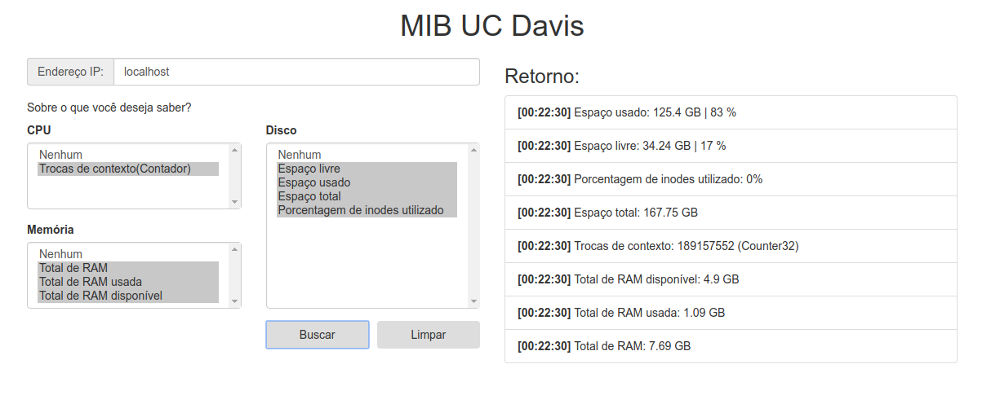

# Uc Davis MIB

Uma API desenvolvida em Node.js, e um client desenvolvido em Angularjs para monitorar o estado de uma máquina utilizando o protocolo SNMP com a MIB(managment information base) da UC Davis. Este projeto foi dedicado à disciplina de Gerência e Administração de Redes (UNISC).

# Interface:

# OIDS Utilizados:

## CPU
    Número de trocas de contexto: 1.3.6.1.4.1.2021.11.60.0
## Memória 
    Total de RAM:       1.3.6.1.4.1.2021.4.5.0
    Total de RAM usada: 1.3.6.1.4.1.2021.4.6.0
    Total de RAM livre: 1.3.6.1.4.1.2021.4.11.0
## Disco
    Tamanho total do disco: 1.3.6.1.4.1.2021.9.1.6
    Espaço livre:           1.3.6.1.4.1.2021.9.1.7
    Espaço usado:           1.3.6.1.4.1.2021.9.1.8
    & espaço usado:         1.3.6.1.4.1.2021.9.1.9
    Porcentagem de inodes:  1.3.6.1.4.1.2021.9.1.10.1

# snmpd.conf:

    rocommunity public
    
    rwcommunity private
    
    includeAllDisks 10%

# site para visualizar uc-davis-mibs
http://www.oidview.com/mibs/2021/UCD-SNMP-MIB.html

